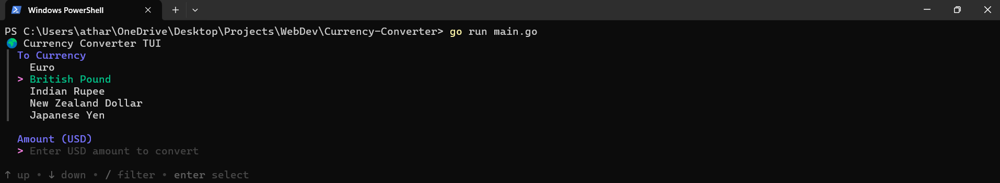

# Currency Converter

A Terminal User Interface (TUI) application for currency conversion using real-time exchange rates from OpenExchangeRates API, built with Go.

## Features

- Real-time currency conversion using OpenExchangeRates API
- Support for EUR, GBP, and JPY conversions from USD
- Interactive terminal interface using Charm's Huh library
- Automatic .env file loading for API key management
- Historical exchange rates from February 16, 2013

